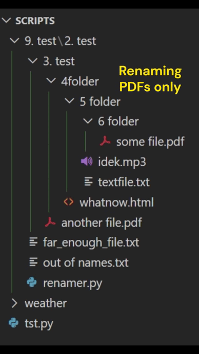

# File_renamer
___


This is a simple python script to recursively traverse through directories starting from a given path, to rename target files after their _numbered_ parent directories.

This is targeting files in the following structure:

```
9. test/
├── 2. test/
│   └── 3. test/
│       ├── 4folder/
│       │   └── 5 folder/
│       │       ├── 6 folder/
│       │       │   └── 6.some file.pdf
│       │       ├── 4.5.textfile.txt
│       │       ├── idek.mp3
│       │       └── whatnow.html
│       └── 3.another file.pdf
├── 9.2.far_enough_file.txt
├── 9.2.out of names.txt
└── main.py
```
where each directory starts with a number.
The main usecase is when you search for ".pdf" files, and get a list of all of them recursively in your current search directory, but they are not ordered so it is hard to track in which order those files are supposed to be opened in.

